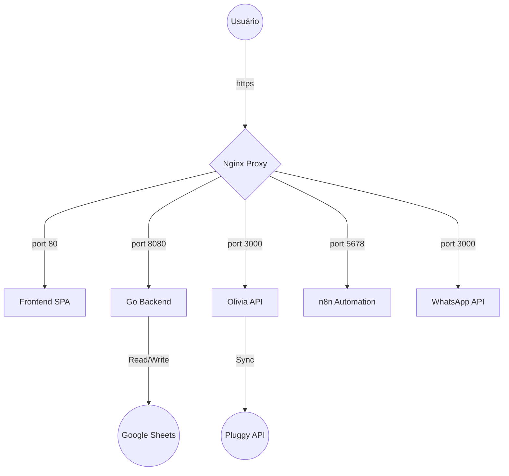

# 🏦 Olivia Installments Conciliation

[](https://golang.org/)
[](https://www.docker.com/)
[](LICENSE)

Sistema inteligente de conciliação financeira automatizada entre **Google Sheets** e **Pluggy API**. Gerencie transações, identifique parcelas e automatize fluxos de auditoria com segurança e alta performance.

---

A aplicação utiliza uma arquitetura de microservices orquestrada por Docker, protegida por um Proxy Reverso Nginx com suporte a HTTPS (Let's Encrypt) e uma camada de autenticação **JWT (JSON Web Tokens)**.



---

## 🚀 Como Executar

### 🐳 Via Docker (Recomendado)

O ambiente completo sobe com um único comando, incluindo os certificados SSL e automações.

1.  **Configuração Inicial**:
    ```bash
    cp .env.example .env
    # Preencha as credenciais no arquivo .env
    ```

2.  **Deploy**:
    ```bash
    docker compose up -d
    ```

3.  **Ativação SSL (Apenas EC2)**:
    ```bash
    chmod +x scripts/setup-ssl.sh
    ./scripts/setup-ssl.sh
    ```

### 💻 Desenvolvimento Local (Sem Docker)

Para testar mudanças rapidamente sem subir toda a infraestrutura:

1.  **Backend (Go)**:
    ```bash
    go run backend/main.go
    # O backend subirá em http://localhost:8080
    ```

2.  **Frontend (Vanilla JS)**:
    ```bash
    cd frontend
    python3 -m http.server 3001
    # Acesse http://localhost:3001
    ```

> [!WARNING]
> Ao rodar localmente sem o Nginx, você precisará alterar as constantes `API_URL` e `EXECUTION_API_URL` no arquivo `frontend/app.js` para apontarem para `localhost` em vez dos subdomínios `.site`.

### 🛠️ Simulando Produção Localmente (Com Docker)

Para testar o roteamento do Nginx no seu computador:
1.  Edite seu arquivo de hosts (`/etc/hosts` no Linux ou `C:\Windows\System32\drivers\etc\hosts` no Windows).
2.  Adicione o mapeamento:
    ```text
    127.0.0.1 console.olivinha.site bff.olivinha.site api.olivinha.site n8n.olivinha.site waha.olivinha.site
    ```
3.  Suba os containers: `docker compose up -d`.

### 🌍 URLs de Acesso

| Serviço | URL |
| :--- | :--- |
| **Aplicação Principal** | [https://console.olivinha.site](https://console.olivinha.site) |
| **Integração Backend** | [https://bff.olivinha.site](https://bff.olivinha.site) |
| **Automação n8n** | [https://n8n.olivinha.site](https://n8n.olivinha.site) |
| **WhatsApp API** | [https://waha.olivinha.site](https://waha.olivinha.site) |

---

## 🛠️ Configuração de CI/CD

O projeto utiliza **GitHub Actions** com **AWS Systems Manager (SSM)** para deploys automáticos e seguros, sem necessidade de chaves SSH expostas.

### 🔐 Secrets & Variables Necessárias

> [!IMPORTANT]
> Configure estas variáveis nas configurações do repositório GitHub para o pipeline `ecr-push.yml`.

| Tipo | Chaves |
| :--- | :--- |
| **Secrets** | `GCP_SERVICE_ACCOUNT_KEY`, `SPREADSHEET_ID`, `PLUGGY_CLIENT_ID`, `PLUGGY_CLIENT_SECRET`, `ADMIN_USER`, `ADMIN_PASS`, `JWT_SECRET` |
| **Variables** | `AWS_REGION`, `ECR_REGISTRY`, `ECR_REPOSITORY`, `APP_DIR`, `DEPLOY_TAG_KEY`, `DEPLOY_TAG_VALUE` |

---

## 🛡️ Segurança

*   **Proxy Reverso**: Todos os serviços rodam em rede interna Docker, acessíveis apenas via Nginx.
*   **Autenticação JWT**: Controle de acesso unificado para o Console e APIs, validado na borda pelo Nginx (`auth_request`).
*   **SSL/TLS**: Criptografia de ponta a ponta via Let's Encrypt.
*   **Infrastructure Hardening**: As portas de gerência (SSH) são fechadas para a internet, utilizando o **AWS SSM Session Manager** para acesso administrativo.

---

## ## Funcionalidades

1. **Fila de Conciliações**: Exibe transações que aguardam pareamento manual.
2. **Algoritmo de Sugestão**: Cruza dados de valor e data para sugerir melhores candidatas.
3. **Fluxo de Aprovação**: Ao aceitar, o sistema escreve o ID de conciliação diretamente na planilha bancária.
4. **Gestão de Rejeitados**: Transações sem par podem ser movidas para uma aba de auditoria.
